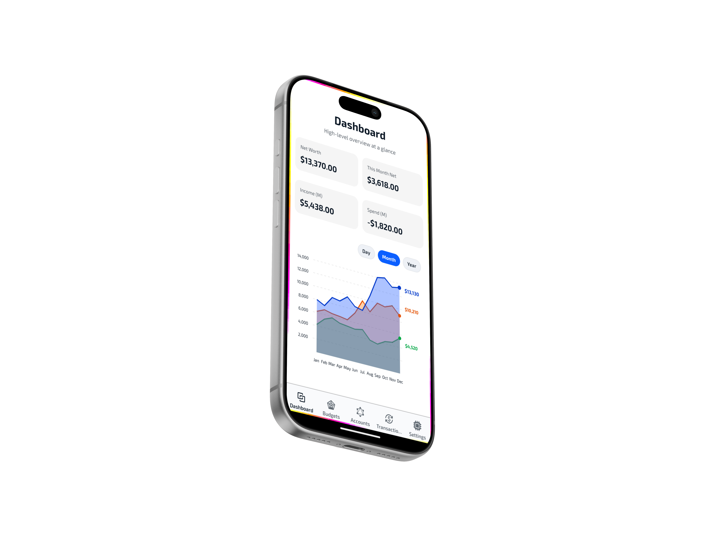
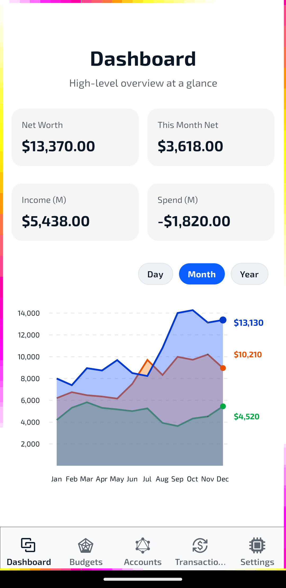
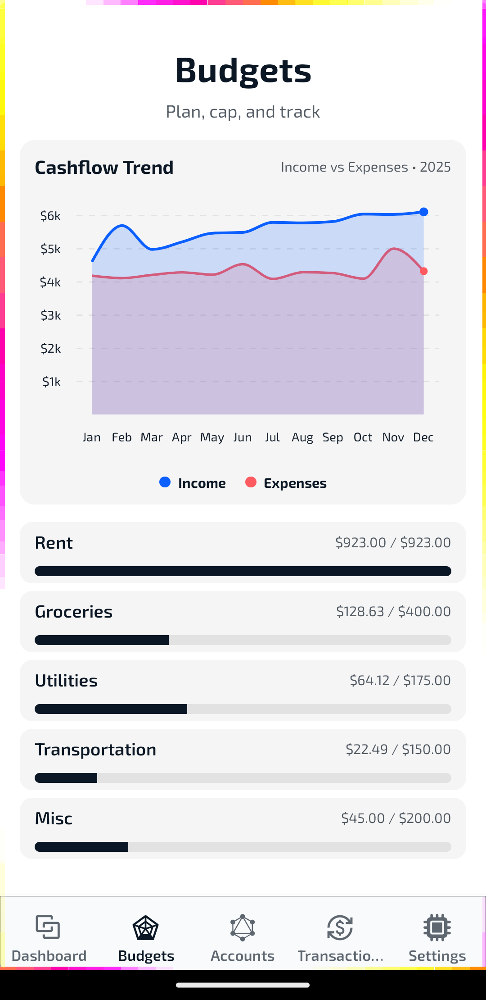
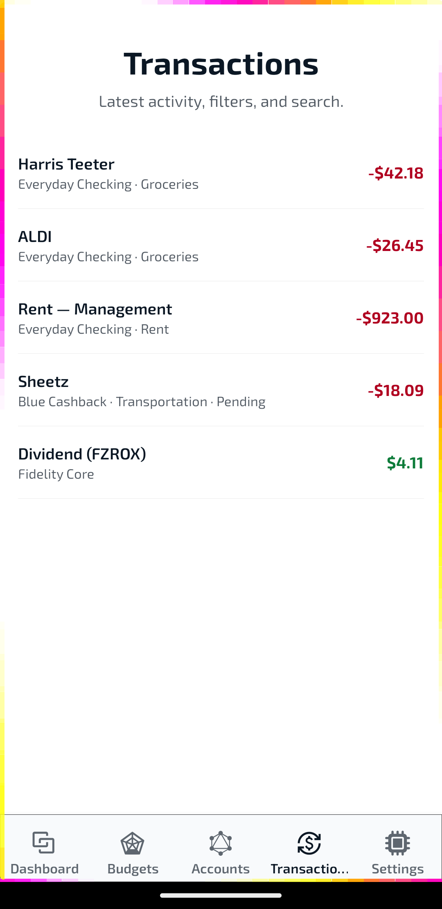
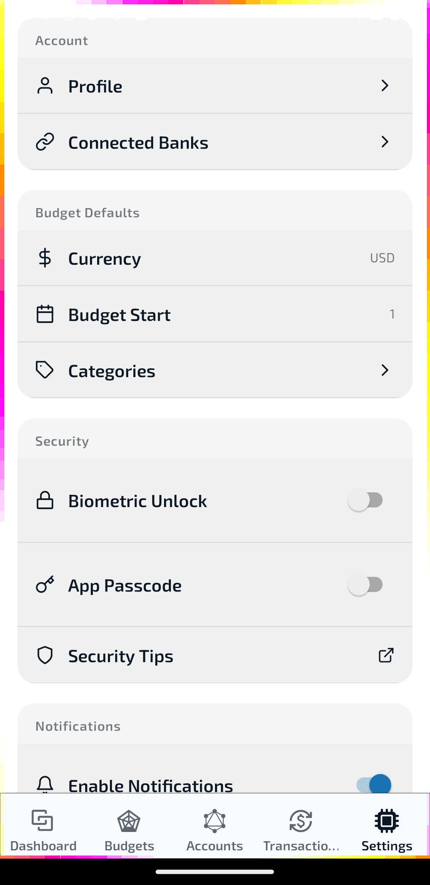
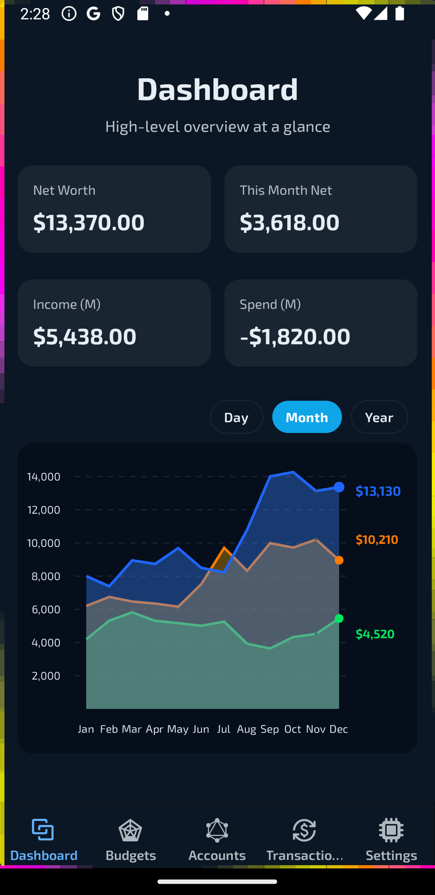
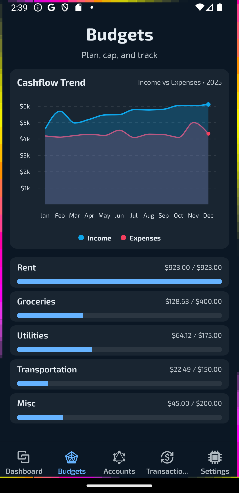
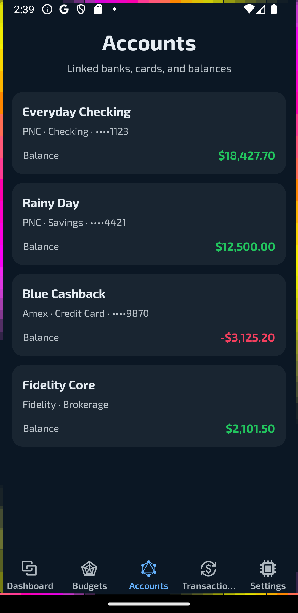
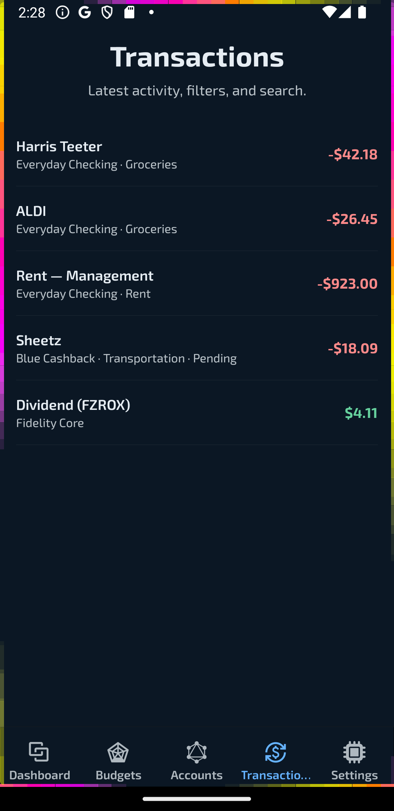
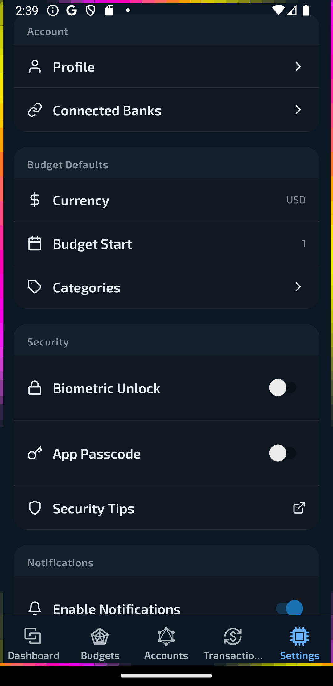

# Lambda — Mobile Finance/Budgeting UI (Showcase, View-Only)

This repo is **screenshots + overview only**. For private code review under NDA, email elishathompson3@gmail.com.

## Preview

<!-- Hero Mockup (presentation) -->

  <!-- Replace with your Previewed.app export -->
  

<!-- Thin brand divider -->

  

## Screenshots

<table>
  <thead>
    <tr>
      <th>Dashboard</th>
      <th>Budgets</th>
      <th>Accounts</th>
      <th>Transactions</th>
      <th>Settings</th>
    </tr>
  </thead>
  <tbody>
    <!-- Light row -->
    <tr>
      <td></td>
      <td></td>
      <td></td>
      <td></td>
      <td></td>
    </tr>
    <!-- Dark row -->
    <tr>
      <td></td>
      <td></td>
      <td></td>
      <td></td>
      <td></td>
    </tr>
  </tbody>
</table>
---

### Brand Notes

- **Palette:** #2562BB (Blue), #9CA3AF (Muted), #111217 (Border/Divider), #0B1724 (Dark BG), #FFFFFF (Light BG)
- **Typography intent:** System fonts in repo; brand fonts applied in-app. README favors clarity over custom webfonts.
- **Assets:**
  - assets/preview/hero-mockup.png (1200–1600px wide)
  - assets/screens/*.png (min 1242×2688 if captured on device or 1080×2340 emulator)

=======
This repo is **screenshots + overview only**. For private code review under NDA, email elishathompson3@gmail.com.

## What this is
- UI/UX showcase only (no runnable code)
- Architecture overview and images for hiring review

## Engagement
- NDA → time‑boxed read access to private repo (per‑viewer watermark)
- Live walkthrough available

## License & Trademarks
- Proprietary Evaluation‑Only (view on GitHub only). See 'LICENSE'.
- “Lambda” marks: all rights reserved.
